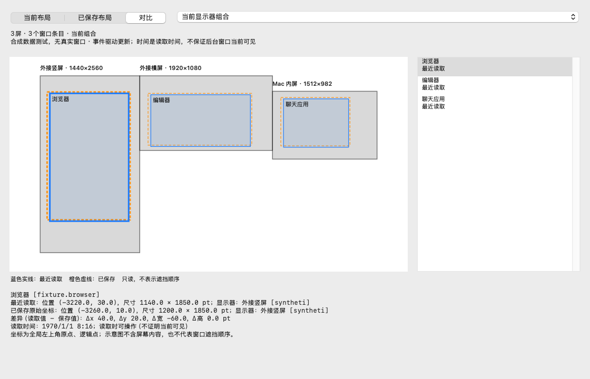

# Window Layout Memory

Remember your workspace, separately for every display setup. Native Swift/AppKit, MIT, no third-party runtime dependencies.

面向 macOS 的窗口布局记忆应用。目标是保留用户在单屏、双屏、多屏环境下分别调整好的窗口大小、位置与显示器归属，在显示器切换和重新登录后恢复，不让系统临时重排覆盖用户偏好。

**v0.3.0-preview.8 / build 12：开发预览，不是稳定版。** 新增原生[关于窗口](docs/ABOUT.md)，集中展示版本、作者、网站、GitHub、文档及MIT协议，适配明暗主题，关闭释放资源。包含[台前调度横屏自动铺满](docs/STAGE_FILL.md)：默认关闭，激活横屏前台窗口后避开菜单栏/Dock铺满，左侧默认100 pt且可通过左边缘拖动调整。按完整显示器组合和显示器ID记忆留白，不覆盖原布局。包含[只读布局预览](docs/PREVIEW.md)，关闭释放预览资源，不新增周期性扫描。尚未完整满足全部实机门禁。



当前实现：前台普通窗口核对、候选保存、按显示器组合隔离基准、锁定、历史回退、保守匹配、可选恢复及一次核验、暂停、排除、私人备份和登录启动设置。自动移动默认关闭。

build 11将菜单整理为12个顶层入口与四个功能组，保留常用操作；完整路径和作用域见[菜单导航](docs/MENU.md)。布局、100 pt默认值与持久偏好不变。本版[发行说明](docs/releases/v0.3.0-preview.8.md)。

build 12移除可能吞掉左侧留白的原生最大化回退，尺寸失败则停止，不再主动把整窗最大化。仍保留运行列表/文件选择的应用例外。真实兼容性及当前交付状态见[状态总览](docs/STATUS.md)。

build 9新增默认关闭的“同时铺满子窗口”及“台前调度铺满”内的窗口例外：支持当前窗口临时排除、有AX标识窗口的精确持久排除及撤销。图片窗若被应用声明为独立主窗口，仍需手动排除；未知类型及对话框、浮动面板不强行铺满。删除多余的设为100 pt菜单，默认值仍为100 pt，保留已记忆留白。

**支持鼠标拖动/缩放后的自动持久记忆。** 新安装默认开启；从旧版升级不擅自改变偏好，请从菜单启用。要求前台窗口标题栏/边缘上的鼠标证据、释放后稳定且不在切屏/恢复保护期内。无法确认的变化只保留候选，包括部分键盘布局操作，仍需点击保存。后台窗口需用户激活，不展开最小化窗口或强制切换台前调度组。

支持布局重命名、手动显示器映射复制、取消待恢复；临时AX错误仅在窗口完全未移动时重试一次。完整角色规则编辑器、启动其它应用尚未完成。

## Build and use

**已包含的恢复修复：** 自动恢复开启且唯一匹配时，先按保存记录确定显示器，再对目标横屏铺满；竖屏恢复原坐标。保护期漏激活修复也包含在build 7。未记录或有歧义的窗口不猜测跨屏。当前安装、验证与未解决问题见[状态总览](docs/STATUS.md)。

```sh
ruby scripts/check-docs.rb
zsh scripts/test-all.sh
zsh scripts/coverage.sh
zsh scripts/build-app.sh
zsh scripts/install-local.sh
zsh scripts/package-release.sh
```

以上是独立工作命令，不是每次都顺序执行：`package-release.sh`本身会重新测试、构建并签名dist产物，但不安装或发布。文档修改只运行文档检查；已有已验证发行包不要为修改说明反复重建。源码有Unreleased改动时，发布前必须统一推进版本，不能覆盖同版本旧发行包。

需要macOS和Swift Command Line Tools。首次打开应用，在系统设置授权辅助功能后点击“重新核对”。依次激活目标窗口，停留约2秒，点击“保存已核对窗口（数量）”。确认基准正确后再启用自动恢复。

当前产物arm64、ad-hoc签名、未公证。本机验证macOS15.6，部署目标macOS13不代表低版本或Intel已验证。

测试包含纯核心回归与注入假窗口服务的Engine集成回归；覆盖率、用例数及实机状态见[测试报告](docs/TESTING.md)。核心行覆盖**不包括Engine、AX、UI**，不得解读为全项目覆盖率。10分钟代表性负载及8小时驻留未通过前，不宣称CPU/内存预算达标。

详见 [使用指南](docs/USER_GUIDE.md)、[测试报告](docs/TESTING.md)、[兼容性](docs/COMPATIBILITY.md)、[发行说明](docs/releases/v0.3.0-preview.8.md)。

## Planned scope

- Separate layouts for distinct monitor identities, arrangements and scaling configurations.
- Automatic learning of deliberate window adjustments, with locked baselines and history.
- Stage Manager-aware handling: never learn sidebar preview bounds as normal window geometry.
- Ordinary desktop operation with Stage Manager OFF is equally required, including switching modes while running.
- Restore existing/reopened ordinary windows after display changes, wake and login.
- Conservative matching of multiple windows from the same application, with visible ambiguity and manual correction.
- Local-only layout storage, export, backup, pause, exclusions and undo.
- Low overhead is a release gate: near-zero idle CPU, bounded memory and no periodic full-window scans. Budgets are in the PRD; measured baselines and remaining acceptance gaps are in the testing report.

Spaces, native full-screen windows and Stage Manager group restoration are out of scope. Recreating arbitrary application documents, tabs or unsaved content is not promised.

## Requirements

Read [v0.1.0 PRD](docs/prd/v0.1.0/prd.md) for scope, user stories, edge cases and 42 acceptance criteria. Requirements and [technical design](docs/prd/v0.1.0/dev.md) are confirmed, but are not a statement of implemented features. See [interaction design](docs/prd/v0.1.0/design.md) and [plan](docs/prd/v0.1.0/plan.md).

Hardware verification and stable release remain gated on the acceptance matrix. Supported macOS versions and architectures are recorded from actual validation.

## Privacy

Do not commit real window titles, document paths, display serial numbers, screenshots or layout exports. Reports and tests must use synthetic or redacted fixtures. No telemetry or cloud upload is planned.

## Version and license

Latest published preview: **0.3.0-preview.7**, build 11. See [release assets](https://github.com/wlzh/window-layout-memory/releases/tag/v0.3.0-preview.7), [CHANGELOG](CHANGELOG.md), and [current status](docs/STATUS.md). Physical AX acceptance still requires Accessibility authorization.

Author: [X @wlzh](https://x.com/wlzh). Website: [869hr.uk](https://869hr.uk).

Copyright (c) 2026 wlzh. Licensed under the [MIT License](LICENSE).
