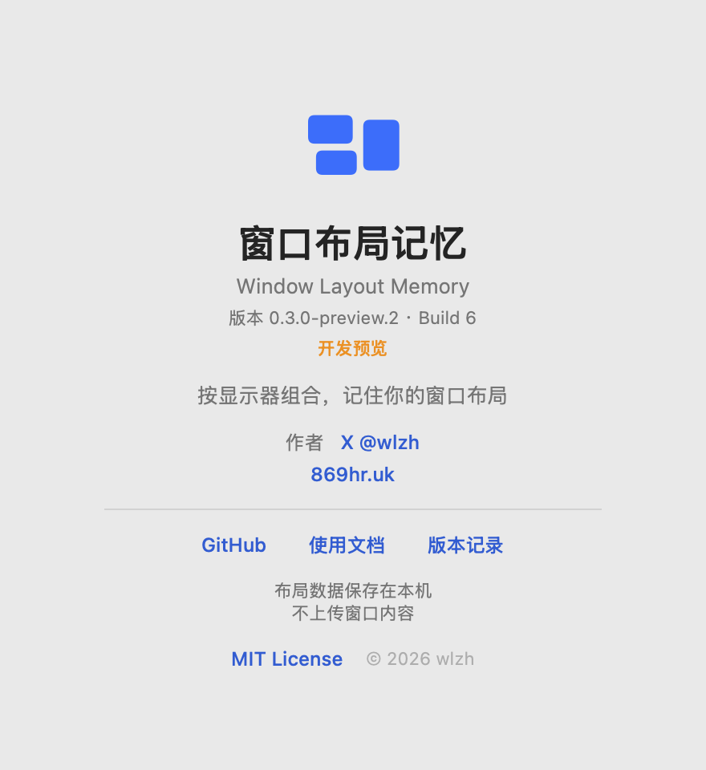
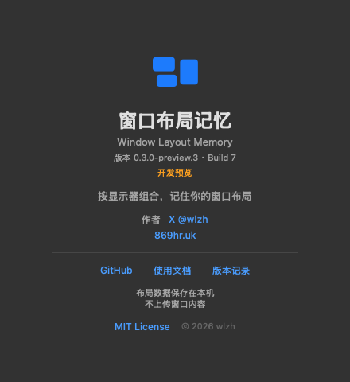

# 关于窗口

v0.3.0-preview.13 / build 20，2026-09-09。关于功能始于preview.2；本版仅随运行元数据更新版本显示。下方截图为历史版本外观参考。

菜单入口“关于窗口布局记忆…”替换原“GitHub / MIT / 文档”；状态和诊断仍单独保留。

## 设计

440×480 pt原生AppKit窗口，使用系统颜色和字体。上部为窗口图标、中文名称、英文名称、运行版本和开发预览标识；中部为功能简述与作者；下部为项目资源、隐私说明和版权。间距与分隔线强调层级，明暗主题均使用不透明原生背景。

## 内容与行为

- 作者：[X @wlzh](https://x.com/wlzh)，网站：[869hr.uk](https://869hr.uk)。
- 项目：[GitHub](https://github.com/wlzh/window-layout-memory)、[使用文档](https://github.com/wlzh/window-layout-memory/blob/main/docs/USER_GUIDE.md)、[版本记录](https://github.com/wlzh/window-layout-memory/releases)、[MIT License](https://github.com/wlzh/window-layout-memory/blob/main/LICENSE)。
- 版本来自AppVersion与应用元数据，不在界面中另写版本常量。
- 链接使用原生按钮，带目标地址提示与辅助功能说明，仅用户点击时打开默认浏览器。
- 布局数据保存在本机，不上传窗口内容；关于窗口不读取私人布局，不发网络请求。
- 打开时按需创建，重复打开复用。关闭清空所有权、视图和链接回调；下次重新创建。不添加轮询、窗口扫描或计时器。

## 测试范围

`swift run WindowLayoutMemory --self-test-about`运行18项AppKit检查，覆盖版本、六个固定URL、未知链接、明暗主题布局、重复打开、关闭释放和重新打开。使用注入URL回调，不实际打开外部网页。

`swift run WindowLayoutMemory --self-test-about --render-about /absolute/output`生成`output-light.png`与`output-dark.png`，本页两图由此生成并目视检查。release禁用该测试入口。完整回归与尚未关闭的原有实机门禁见[测试报告](TESTING.md)。
